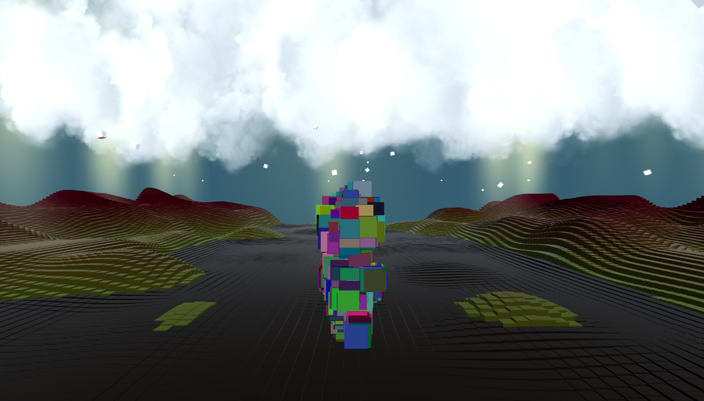
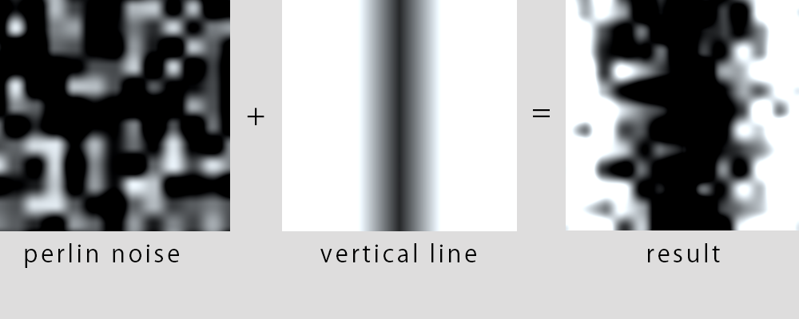

# UnityComputeProceduralMap
It's just one of my compute shader demo. It results that it takes only 19 SetPass calls and 25 batches to make this demo. 

## Procedural Map Generation

First of all, I used the fragment shader to check how the procedural map looks like. 
Images above is a how to approach the final result of the procedural map. 
All these calculations that I brought into the compute shader. 
 

It tested on the Windows 10 and Unity 2018.2.4f1.
